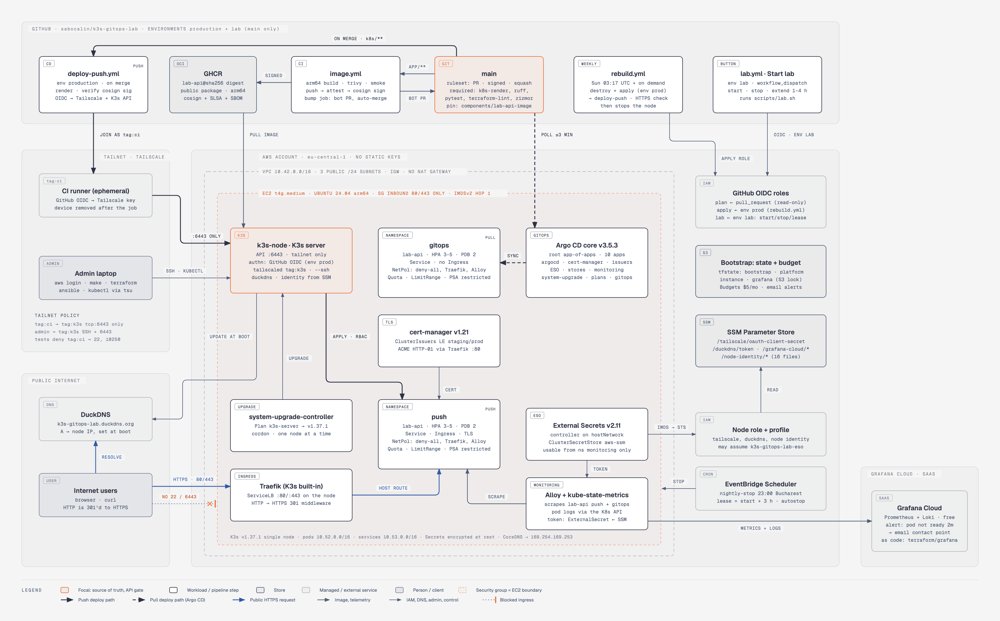

# k3s-gitops-lab

Zero-cost K3s on AWS: Terraform, Ansible, FastAPI, GitHub Actions push CD and ArgoCD GitOps.

A learning project that builds a small but complete platform on a single EC2 node,
entirely from code, and then deliberately breaks it. Work is tracked on the
[project board](https://github.com/users/sabocalin/projects/1).

New to the project? [How it works, in plain terms](docs/learning/how-it-works.md) explains
every layer from the ground up.

## Architecture

Full diagrams (rendered from the repository at `3eed723`): [infrastructure](docs/architecture/k3s-gitops-lab-architecture.png) ([SVG](docs/architecture/k3s-gitops-lab-architecture.svg)) and [push vs pull delivery](docs/architecture/k3s-gitops-lab-delivery.png) ([SVG](docs/architecture/k3s-gitops-lab-delivery.svg)). The `.html` versions add cards for the lifecycle commands, both delivery paths and the trust boundaries.



```
internet ──80/443──▶ k3s-gitops-lab.duckdns.org ─▶ EC2 t4g.medium (K3s)
                       ├─ Traefik ingress ─▶ FastAPI, namespace push (3-5 replicas)
                       ├─ cert-manager (Let's Encrypt)
                       ├─ External Secrets ─▶ SSM Parameter Store (narrow role)
                       ├─ Alloy ─▶ Grafana Cloud (metrics, logs; free tier)
                       └─ ArgoCD (core) ─▶ FastAPI, namespace gitops (synced from main)

admin ──Tailscale──▶ SSH + Kubernetes API   (no public 22 or 6443)
GitHub Actions ──OIDC──▶ AWS (no stored keys)
GitHub Actions ──Tailscale──▶ Kubernetes API (push deploys)
GitHub Actions ──bot PR──▶ main (new image digest) ◀──polls── ArgoCD (pull deploys)
```

- Address ranges: VPC `10.42.0.0/16`, pods `10.52.0.0/16`, Services `10.53.0.0/16`. They must not overlap; an Ansible guard checks this (#90).
- Infrastructure: Terraform (S3 backend) + Ansible installs K3s. Four stacks, each with
  its own state in the bootstrap bucket:

  | Stack | Contents | Lifetime |
  |---|---|---|
  | `terraform/bootstrap` | state bucket, budget alert, alternate contacts, GitHub OIDC roles | permanent |
  | `terraform/platform` | VPC, three public subnets (one per zone; the node uses one), internet gateway, security groups, IAM roles (node, ESO, autostop) | permanent (all free). SSM parameters are created by hand; Terraform knows only their names |
  | `terraform/instance` | the EC2 instance | stopped when idle, destroyed and rebuilt weekly |
  | `terraform/grafana` | Grafana Cloud alerting: the readiness alert and its email contact point (#49); run with `scripts/tf-grafana.sh` | permanent |
- Images: built natively for arm64 in GitHub Actions, pushed to GHCR, signed.
- Deploys: two paths to separate namespaces, push (`kubectl apply` from Actions)
  and pull (ArgoCD watching this repo). ArgoCD also manages cert-manager and itself
  (app-of-apps, #43). New cluster: `kubectl apply -k k8s/platform/argocd --server-side`,
  then `kubectl apply -k k8s/platform/argocd-apps` once; git does the rest.

## Daily use

Everything runs from the laptop with the `personal` AWS profile (`aws login --profile
personal`) and Tailscale up (`tsu up`); `scripts/lab.sh` refuses any other AWS account.

| Command | What it does |
|---|---|
| `make start` | start the node, set a 3 h lease, wait for K3s, then for `k3s-gitops-lab.duckdns.org` to point at the new IP and answer |
| `make extend` | move the lease to 3 h from now (`LEASE_MINUTES=60` for another length) |
| `make stop` | stop the node now and remove the lease |
| `make status` | node state and address, lease, nightly stop, tailnet |
| `make plan` | read-only plan of the instance stack |
| `make up` | build the node from nothing: plan, confirm, apply, Tailscale, Ansible |
| `make down` | destroy the instance stack (the platform stack stays); plan and confirm first |
| `make kubeconfig` | fetch the admin kubeconfig into `~/.kube` (a credential: run it yourself). After `make up` (a new cluster), also refresh `k8s/ci/cluster-ca.crt` from it, or push deploys fail with an x509 error (#39) |
| `make lint` | `terraform fmt`/`validate`, tflint, trivy: the same checks as CI, no AWS access |
| `make test` / `make run` | the app (`app/`): ruff + pytest / serve on `localhost:8000` |
| `make image` | build the container image `lab-api:dev` (linux/arm64) |
| `make k8s` | render and check, as CI does: `k8s/namespaces/*` (namespace + guardrails, admin) with `k8s/overlays/*` (the app, deployer), and `k8s/platform/*` |

Without the laptop: **Actions → lab → Run workflow** (on the web, also in a phone's browser) runs
`scripts/lab.sh start`, `stop` or `extend` with a lease of 1–4 h, using the
`k3s-gitops-lab-github-lab` role (#63). The run's summary shows the public IP, the sslip.io
hostname, DuckDNS and whether `/health` answers. It doesn't wait for K3s over Tailscale.

## Container image

`app/Dockerfile`, two stages. The build stage installs the locked dependencies with hash
checks. The final stage is distroless Python (`gcr.io/distroless/python3-debian13:nonroot`):
no shell, no package manager, UID/GID **65532**, code owned by root and not writable,
works with a read-only root filesystem. All bases are pinned by digest.

| Image (linux/arm64) | Compressed | On disk |
|---|---|---|
| **lab-api** | **27.9 MB** | **126 MB** |
| distroless base alone | 22.6 MB | 103 MB |
| `python:3.13-slim` base alone (the alternative) | 43.3 MB | 202 MB |

## Cost model

Target: **near $0**, about $3/month. The AWS account is on the **paid plan with no
credits** (the Free plan was not available for it), so nothing caps spending: the design
keeps billable resources small and running only when used. Prices are approximate
eu-central-1 on-demand list prices, before VAT; check the pricing pages.

| Resource | Free allowance | Cost |
|---|---|---|
| EC2 `t4g.medium` (since #40; `t4g.small` was too small for Argo CD) | none (the free trial covers `t4g.small` only) | ~$0.0384/h: ~$1.54/month at 40 h, ~$28/month 24/7 |
| EBS gp3, 12 GB | none | ~$1.14/month, **billed even while the instance is stopped** |
| Public IPv4 address | none | ~$0.005/h (~$3.60/month) while attached; $0 while stopped |
| Data transfer out | 100 GB/month | ~$0.09/GB above that |
| S3 (Terraform state) | — | Cents |
| SSM Parameter Store (standard, AWS-managed key) | Free | Free |
| EventBridge Scheduler (nightly auto-stop) | Free monthly invocations | Free |
| AWS Budgets (one budget, no actions) | Free | Free |
| GitHub Actions, GHCR | Free for public repos and public packages | — |
| Tailscale, Grafana Cloud, Gemini API, DuckDNS | Free personal / free tiers | — |

**Running model: stop when idle.** `make start` / `make stop` around each session. Two
safety nets stop a forgotten node: a **session lease** (every `make start` schedules a stop
3 hours later) and a nightly auto-stop at 23:00 Europe/Bucharest. A weekly
destroy-and-rebuild drill proves everything comes back from git.

| Usage (~40 h/month running, `t4g.medium` since #40) | Per month |
|---|---|
| **Stop when idle** (chosen): EC2 ~$1.54 + disk ~$1.14 + IPv4 while running ~$0.20 | **~$2.90** |
| Destroy when idle: EC2 + IPv4, the disk only exists while running | ~$1.80 |
| Running 24/7 (for comparison): EC2 ~$28 + disk + IPv4 ~$3.60 | ~$33 |

The weekly rebuild (#64) runs the node about 25 minutes a week: ~$0.07/month.

Notes:

- **Nothing caps spend on a paid account.** The realistic risk is leaked credentials
  (someone mining crypto on your bill), not this project's resources. Mitigations: no
  long-lived access keys anywhere (`aws login` locally, OIDC in CI), MFA on root and
  the admin user, and the budget alert.
- **Public IPv4 costs only while the instance runs.** Stopping releases the
  auto-assigned address (a new IP on every start). An Elastic IP would keep the address
  stable but bills ~$3.60/month even while stopped. Instead the node points the free
  DuckDNS name `k3s-gitops-lab.duckdns.org` at its new IP at every boot (#36).
- **Egress** comes from responses to users, Alloy shipping metrics and logs to
  Grafana Cloud, and Tailscale traffic. Pulling images from GHCR is inbound and
  free. Expected volume is far below 100 GB/month.
- **Guardrail:** a $5/month AWS Budgets alert, on actual spend ≥ 80% and forecasted
  spend ≥ 100%. Any alert means something unplanned is running.
- **2026-12-31:** the `t4g.small` trial ends (no longer used since #40); decide stop-when-idle vs 24/7 (#53).

## Never create

These are easy to add by accident and break the near-$0 target.

| Resource | Approx. cost | Use instead |
|---|---|---|
| Application / Network Load Balancer | ~$16/month + usage | K3s built-in Traefik + ServiceLB |
| NAT Gateway | ~$33/month + $0.045/GB | Public subnet, instance has its own public IP |
| EKS control plane | ~$73/month | K3s |
| Idle Elastic IP | ~$3.60/month | Auto-assigned public IP |
| Route 53 hosted zone | $0.50/month | DuckDNS (`k3s-gitops-lab.duckdns.org`, updated at boot) |
| Customer-managed KMS key | $1/month | AWS-managed keys (`aws/ssm`, `aws/s3`) |
| VPC interface endpoints | ~$7/month per AZ | Public AWS endpoints over the instance's public IP |

## CI access to AWS (GitHub OIDC)

No AWS access keys exist anywhere. GitHub Actions gets one-hour credentials by trading
a GitHub-signed OIDC token for a role. All three roles are in the bootstrap stack, which is
applied only from the laptop, so CI can never change its own permissions.

| Role | Assumable by | Can | Cannot |
|---|---|---|---|
| `k3s-gitops-lab-github-plan` | `pull_request` runs of this repo | read everything (`ReadOnlyAccess`), write Terraform lock files | write state, change anything, read the Tailscale secret |
| `k3s-gitops-lab-github-apply` | jobs in the `production` environment (`main` only) | run, start, stop and terminate the project's instance (`t4g.small`/`t4g.medium`, Ubuntu image, project subnet and security group); manage `k3s-gitops-lab-*` schedules; write the instance stack's state | change IAM, the VPC, security groups or the budget; read the secret |
| `k3s-gitops-lab-github-lab` | jobs in the `lab` environment (`main` only): the "Start lab" button | describe instances; start and stop the project's instance (both tags must match); create, update and delete the session lease schedule, passing it the autostop role | create, resize or terminate anything; touch the nightly stop; read state or secrets |

Network, IAM and budget changes are applied from the laptop (admin with MFA). Details and
the verification: [docs/learning/16-github-oidc-roles.md](docs/learning/16-github-oidc-roles.md).

## Design notes

### Terraform state locking

The S3 backend uses native locking (`use_lockfile = true`, Terraform 1.10+).
DynamoDB-based locking (`dynamodb_table`) is deprecated since Terraform 1.11.
To migrate an existing backend, set `use_lockfile = true` alongside
`dynamodb_table` and run `terraform init -reconfigure`; once every user and
pipeline runs Terraform 1.10+, remove `dynamodb_table`, re-init, and delete the table.
